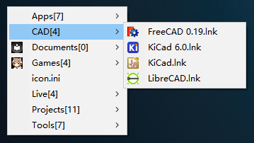

# ahko

> tested with Autohotkey 2.0-beta.3 on Windows 10

ahko is a quick launcher for windows.

## Screenshots

### Gridview :

### Listview :

## Setup

right click the `ahko` tray icon, and then click the `Setup`

## Usage

ahko scans two levels of directories in the watch folder. The number of objects per directory level is limited to 16. This means that a maximum of 16x16 = 256 objects can be listed.
This is because too many objects would NOT make the launcher "quick" enough.

### icon

Icons for `exe` and `lnk` can be obtained automatically. Folder icons can be set by placing an image with the name `_icon.png` in the folder.

## Template

Created with ahk autoupdate [template](https://github.com/Nigh/ahk-autoupdate-template/generate)

