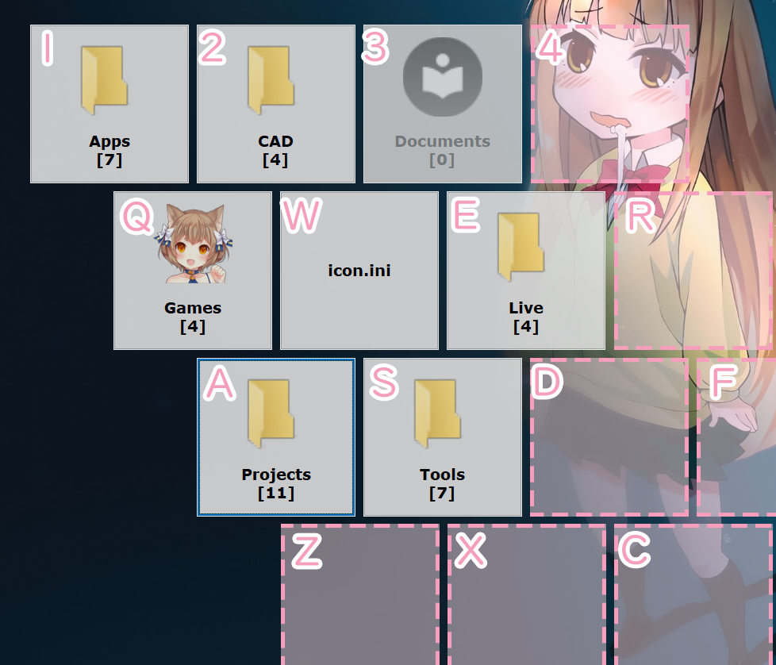
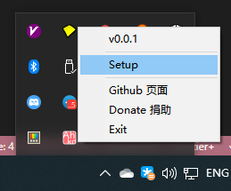
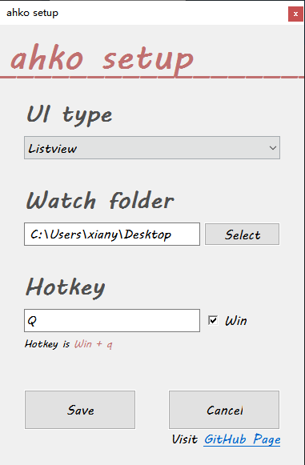

# ahko

> tested with Autohotkey 2.0.7 on Windows 11

ahko is a quick launcher for windows.

## Screenshots

### Native Gridview :

## Setup

right click the `ahko` tray icon, and then click the `Setup`

## Usage

ahko scans two levels of directories in the watch folder.
The number of objects per directory level is limited to `16`. So that a maximum of `16x16 = 256` objects can be used in ahko.

### icon

Icons can be obtained automatically. And you can set it by your own.
Folder icons can be set by placing a png image with the name `_icon.png` in the folder.
Item's icon can be set by placing a png image with the same name as the item. For example, put `abc.lnk` and `abc.png` in the same folder, the icon of `abc.lnk` would be set to `abc.png`.

## Template

Created with ahk autoupdate [template](https://github.com/Nigh/ahk-autoupdate-template/generate)
