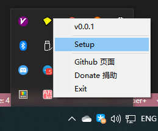
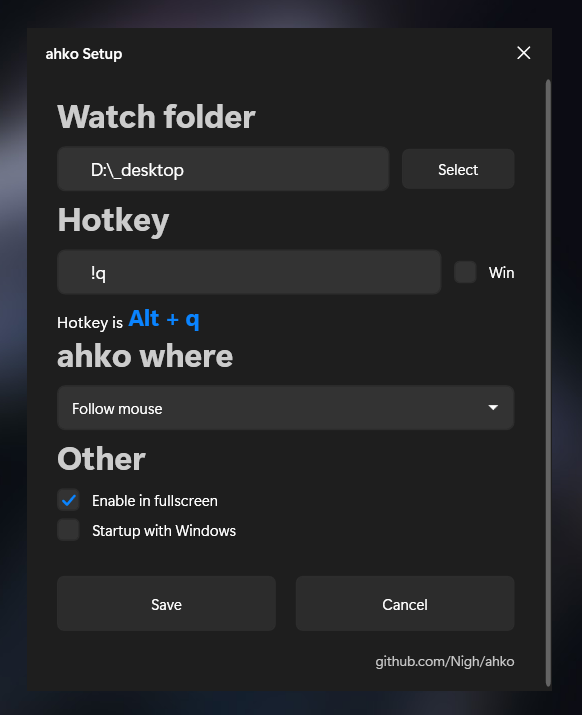

# ahko

ahko is a quick launcher for windows.

## Screenshots

### GDIp Gridview :

## Setup

The setup window is built with [ahk-xaml](https://github.com/owhs/ahk-xaml) (WPF UI hosted from AutoHotkey v2). Layout is defined in `setup/setup.axml`; logic lives in `setup/ahko_setup_gui.ahk`. The vendored framework is kept isolated under `lib/ahk-xaml/`.

Right-click the `ahko` tray icon, then click **Setup**.

### ahk-xaml integration

| Path | Role |
|------|------|
| `lib/ahk-xaml/` | Vendored [ahk-xaml](https://github.com/owhs/ahk-xaml) engine (WPF host, generator, components) |
| `setup/setup.axml` | Declarative setup UI markup (AXML) |
| `setup/ahko_setup_gui.ahk` | Setup window logic, config read/write, event handlers |
| `themes.ini` | Default theme tokens consumed by the framework |

Setup fields mirror the earlier native GUI: watch folder, hotkey (+ Win modifier), display monitor, fullscreen toggle, and Windows startup. The main launcher grid still uses GDIp rendering.

## Usage

ahko scans two levels of directories in the watch folder.
The number of objects per directory level is limited to `16`.
So that a maximum of `16x16 = 256` objects can be used in ahko.

Use hotkey set in `Setup` page to show launcher.

<code>`</code> key back to upper level.

`Esc` to hide the launcher.

### icon

Icons can be automatically get from the file. And you can set it by your own.  
Folder icons can be set by placing a png image with the name `_icon.png` in the folder.  

Item's icon can be set by placing a png image with the same name as the item.  
For example, put `abc.lnk` and `abc.png` in the same folder, the icon of `abc.lnk` would be set to `abc.png`.

## Auto Start & Tray Menu

ahko uses Windows Task Scheduler to enable auto-start at login with administrator privileges. This ensures ahko can properly interact with other windows that are running as administrator.

> **Note:** When running with administrator privileges via auto-start, the system tray icon may not be visible. This is a known side effect of the current auto-start method.

To access the tray menu when the tray icon is not available, click the **"More"** button in the ahko grid view title bar. This will display the same context menu that would normally appear when right-clicking the tray icon, including options such as Setup, GitHub, Donate, Reload, and Exit.

## Template

Created with ahk autoupdate [template](https://github.com/Nigh/ahk-autoupdate-template/generate)

## Changelog

- Remove Native UI mode, only GDIp rendering is supported.
- Close ahko window automatically when clicking outside or pressing non-hotkey keys (misfire detection).
